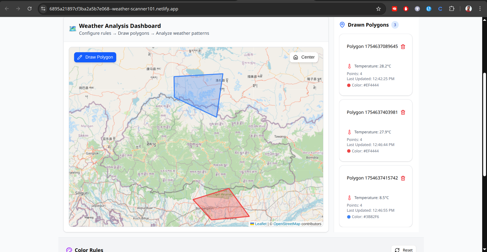
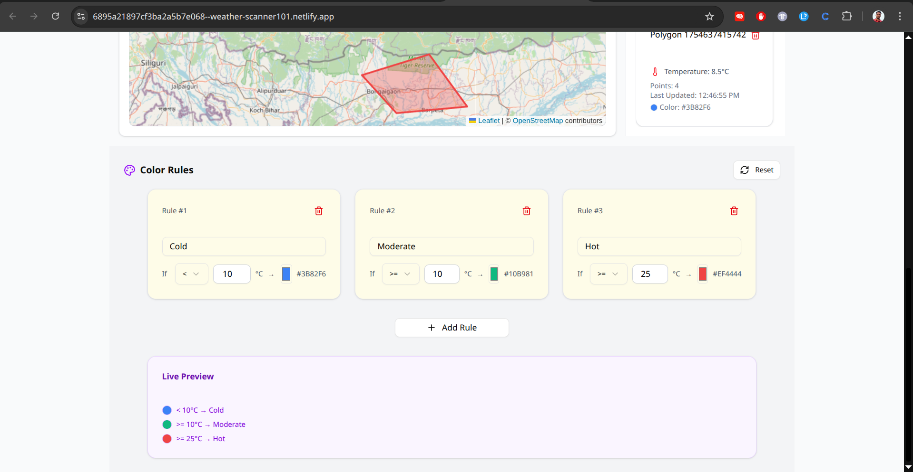

# Weather Analysis Dashboard

[](https://nextjs.org/)
[](https://www.typescriptlang.org/)
[](https://tailwindcss.com/)

A real-time weather analysis dashboard that allows users to draw polygons on a map and visualize temperature data. Features include temperature-based color coding, timeline controls, and dynamic data updates.

🌐 [Live Demo](https://mwv-dashboard.vercel.app/)

## Features

- 🗺️ Interactive map with polygon drawing tools
- 🌡️ Real-time temperature data visualization
- 📊 Color-coded regions based on temperature rules
- ⏲️ Timeline controls for historical data
- 📱 Responsive design for all devices

## Screenshots

<table>
  <tr>
    <td>
    
      
      <em>Dashboard Overview</em>
    </td>
    <td>
      
      <em>Color controls</em>
    </td>
  </tr>
</table>

## Technology Stack

- **Framework**: Next.js 13.4 (App Router)
- **Language**: TypeScript
- **Styling**: Tailwind CSS
- **Map**: Leaflet/react-leaflet
- **Weather Data**: Open-Meteo API
- **State Management**: Custom store implementation
- **UI Components**: Radix UI primitives
- **Date Handling**: Custom date utilities

## Getting Started

### Prerequisites

- Node.js 16.8 or later
- npm or yarn package manager

### Installation

1. Clone the repository
```bash
git clone https://github.com/AbdurRohit/Weather-Ds.git
cd Weather-Ds
```

2. Install dependencies
```bash
npm install
# or
yarn install
```

3. Start the development server
```bash
npm run dev
# or
yarn dev
```

4. Open [http://localhost:3000](http://localhost:3000) with your browser

## Project Structure

```
src/
  ├── app/           # Next.js app router pages
  ├── components/    # React components
  │   ├── ui/       # Shared UI components
  │   └── ...       # Feature components
  ├── lib/          # Utility functions and stores
  └── styles/       # Global styles
```

## Key Features Explained

### Map Interaction
- Draw polygons to define areas of interest
- Real-time temperature data fetching for drawn regions
- Color-coded visualization based on temperature rules

### Temperature Analysis
- Define custom color rules for temperature ranges
- Real-time updates as timeline changes
- Historical data analysis capabilities

### Timeline Controls
- Select specific points in time
- Range selection for historical analysis
- Automatic data updates on time change

## Contributing

Contributions are welcome! Please feel free to submit a Pull Request.

## License

This project is licensed under the MIT License - see the [LICENSE](LICENSE) file for details.

## Acknowledgments

- [Open-Meteo](https://open-meteo.com/) for providing weather data API
- [Leaflet](https://leafletjs.com/) for the interactive mapping capabilities
- [Radix UI](https://www.radix-ui.com/) for accessible UI primitives
